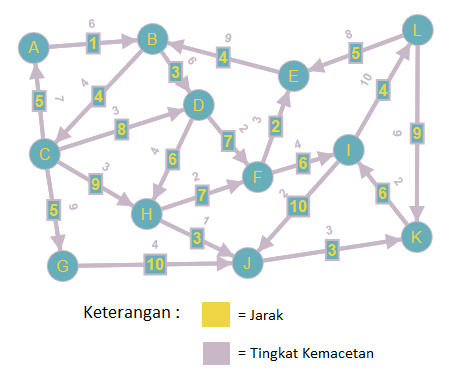
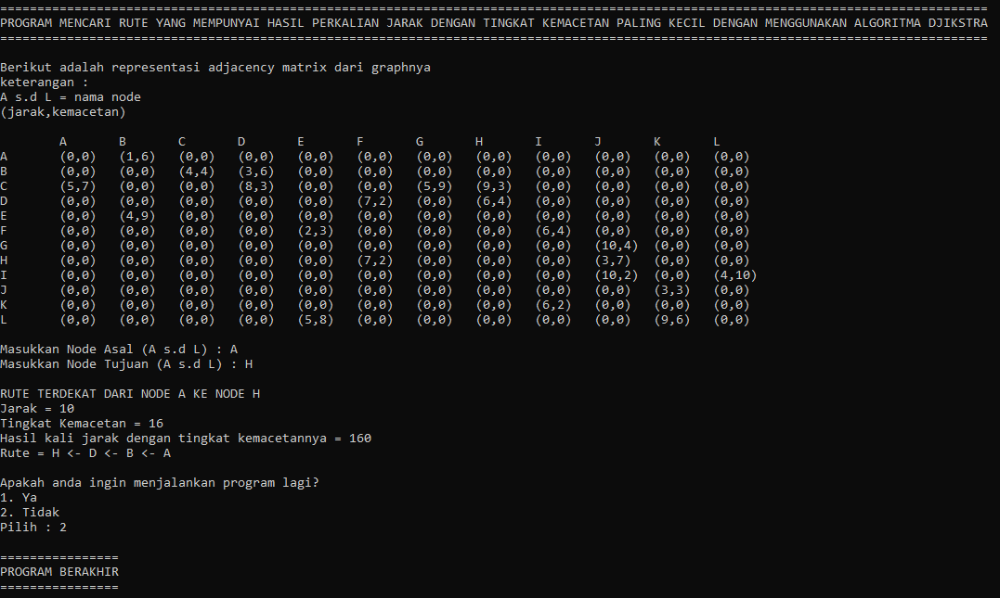
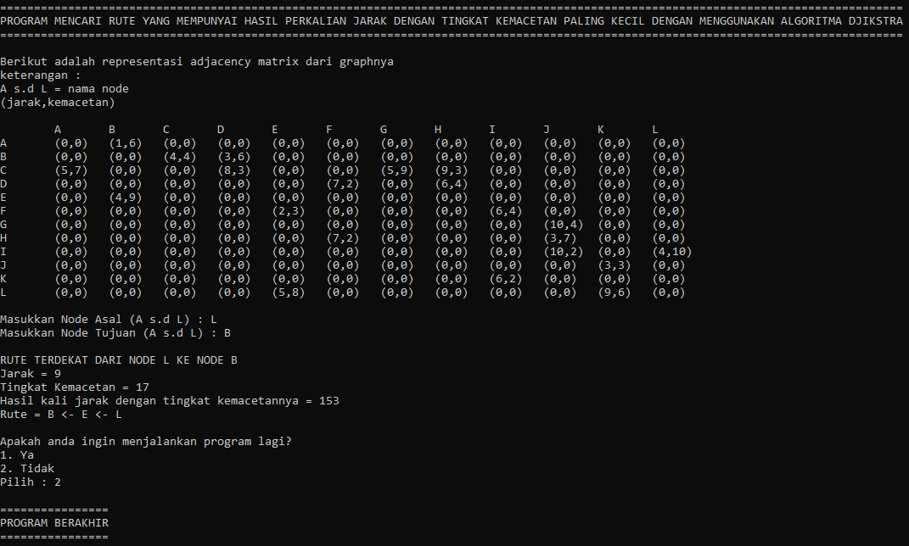

# MENCARI RUTE TERDEKAT GRAPH

- Program untuk mencari rute terdekat graph berbobot (disini ada 2 bobot yaitu jarak dan tingkat kemacetan) 
- Menggunakan bahasa C++ dan alogritma dijkstra

## Source Code

Kodingan ini memiliki 2 source code yang berbeda, yaitu:
1. [Menggunakan array](Code/array.cpp)
2. [Menggunakan linked list](Code/linked_list.cpp)

### Graphnya

### Screenshot Program

- 
- 
